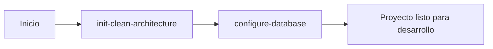

# APSYS Backend Development Guides

> **Versión:** 1.1.1 | **Release:** 2025-01-30 | **Estado:** Milestone 1 Completado

## Descripción

Este repositorio contiene las **guías de desarrollo** y **templates** utilizados por el servidor MCP (Model Context Protocol) de APSYS para automatizar la creación de proyectos backend con **Clean Architecture**.

El servidor MCP permite a Claude generar automáticamente estructuras completas de proyectos .NET siguiendo las mejores prácticas y estándares de APSYS, eliminando el trabajo manual repetitivo y asegurando consistencia entre proyectos.

## Versionado

Este repositorio usa **versionado semántico** (MAJOR.MINOR.PATCH):

- **Versión actual:** 1.1.1
- **Compatibilidad:** .NET 9.0, MCP Protocol 1.0
- **Documentación completa:** [VERSIONING.md](VERSIONING.md)
- **Metadata de versión:** [guides-version.json](guides-version.json)

**Para el servidor MCP:**
```typescript
// Leer versión
const version = await fetch(
  'https://raw.githubusercontent.com/.../guides-version.json'
).then(r => r.json())

console.log(`Using APSYS Guides v${version.version}`)
```

## ¿Qué es MCP?

**Model Context Protocol (MCP)** es un protocolo estándar que permite a modelos de IA como Claude acceder a diferentes servicios y herramientas de manera unificada.

En lugar de que Claude tenga que aprender APIs individuales de cada servicio, MCP proporciona un conjunto de "tools" estandarizados que Claude puede invocar directamente.

**Analogía:** Piensa en MCP como las "puertas y ventanas" de una casa que permiten interactuar con el exterior de manera estándar, en lugar de tener que romper una pared cada vez que quieres salir.

## Propósito del Repositorio

Este repositorio sirve como la **fuente de verdad** para:

1. **Guías paso a paso** de cómo construir proyectos backend
2. **Templates** de código que el servidor MCP utiliza
3. **Documentación técnica** de la arquitectura y componentes
4. **Estándares** de desarrollo del equipo APSYS

## Estructura del Repositorio

```
apsys-backend-development-guides/
│
├── README.md                                 # Este archivo
├── MANUAL_CONSTRUCCION_PROYECTO.md          # Manual técnico completo
├── conversacion-mcp-servers.txt             # Conversación de diseño original
│
├── guides/                                   # Guías de desarrollo por tool
│   ├── README.md                             # Índice de guías
│   │
│   ├── init-clean-architecture/              # Tool #1: Inicialización
│   │   ├── README.md
│   │   ├── 01-estructura-base.md
│   │   ├── 02-domain-layer.md
│   │   ├── 03-infrastructure-filtering.md       (pendiente)
│   │   ├── 04-infrastructure-repositories.md    (pendiente)
│   │   ├── 05-application-layer.md              (pendiente)
│   │   ├── 06-webapi-base.md                    (pendiente)
│   │   ├── 07-migrations-base.md                (pendiente)
│   │   └── 08-testing-projects.md               (pendiente)
│   │
│   └── configure-database/                   # Tool #2: Configuración BD
│       ├── README.md                            (pendiente)
│       ├── 01-setup-postgresql.md               (pendiente)
│       └── 02-setup-sqlserver.md                (pendiente)
│
└── templates/                                # Templates de código (futuro)
    └── (por definir)
```

## Tools del Servidor MCP

### 1. init-clean-architecture

**Estado:** 🟡 En desarrollo (Milestone 1 completado)

Crea la estructura completa de un proyecto backend con Clean Architecture, independiente de cualquier base de datos específica.

**Uso:**
```bash
init-clean-architecture --name=MiProyecto --version=net9.0 --path=C:\projects\miproyecto
```

**Documentación:** [guides/init-clean-architecture/README.md](guides/init-clean-architecture/README.md)

**Genera:**
- Solución .NET con gestión centralizada de paquetes
- Capa de dominio con entidades y validaciones
- Sistema de filtering avanzado con LINQ dinámico
- Implementaciones base de repositorios
- API REST con FastEndpoints
- Sistema de migraciones con FluentMigrator
- Proyectos de testing completos

---

### 2. configure-database

**Estado:** ⏳ Pendiente

Configura un proyecto existente para trabajar con una base de datos específica (PostgreSQL o SQL Server).

**Uso:**
```bash
configure-database --project-path=C:\projects\miproyecto --db=PostgreSQL
# o
configure-database --project-path=C:\projects\miproyecto --db=SQLServer
```

**Documentación:** [guides/configure-database/README.md](guides/configure-database/README.md) *(pendiente)*

**Configura:**
- Paquetes NuGet específicos de BD (Npgsql o Microsoft.Data.SqlClient)
- Driver y dialect de NHibernate
- ConnectionStringBuilder
- Proyecto NDbUnit para datos de prueba
- Sistema de migraciones
- Variables de entorno

---

## Arquitectura de Proyectos Generados

Los proyectos generados siguen los principios de **Clean Architecture**:

```
┌─────────────────────────────────────────┐
│            WebApi Layer                 │
│      (FastEndpoints + Swagger)          │
└──────────────┬──────────────────────────┘
               │ depende de
┌──────────────▼──────────────────────────┐
│         Application Layer               │
│       (Use Cases + DTOs)                │
└──────────────┬──────────────────────────┘
               │ depende de
┌──────────────▼──────────────────────────┐
│           Domain Layer                  │
│  (Entities + Interfaces + Rules)        │
│         ★ NÚCLEO ★                      │
└──────────────▲──────────────────────────┘
               │ implementado por
┌──────────────┴──────────────────────────┐
│       Infrastructure Layer              │
│   (Repositories + NHibernate + BD)      │
└─────────────────────────────────────────┘
```

### Características Clave

✅ **Independencia de frameworks** - Lógica de negocio sin dependencias externas
✅ **Independencia de UI** - Domain no conoce la API
✅ **Independencia de BD** - Domain no conoce la persistencia
✅ **Testeable** - Cada capa tiene sus propios tests
✅ **Separación de responsabilidades** - Cada capa tiene un propósito claro

## Stack Tecnológico

### Backend Core
- **.NET 9.0** - Framework base
- **C# 13** - Lenguaje
- **FastEndpoints 7.0** - Framework de API REST (alternativa ligera a MVC)

### Persistencia
- **NHibernate 5.5** - ORM
- **FluentMigrator 7.1** - Migraciones de BD
- **PostgreSQL** o **SQL Server** - Base de datos

### Validación & Mapeo
- **FluentValidation 12.0** - Validaciones declarativas
- **AutoMapper 15.0** - Mapeo automático de objetos

### Testing
- **NUnit 4.2** - Framework de testing
- **Moq 4.20** - Mocking framework
- **AutoFixture 4.18** - Generación automática de datos de prueba
- **FluentAssertions 8.5** - Aserciones expresivas

### Utilidades
- **Spectre.Console 0.50** - CLI interactiva elegante
- **DotNetEnv 3.1** - Gestión de variables de entorno
- **System.Linq.Dynamic.Core 1.6** - LINQ dinámico para filtering

## Flujo de Trabajo

### Para crear un proyecto nuevo desde cero:



**Paso 1:** Inicializar arquitectura base
```bash
init-clean-architecture --name=MiProyecto --version=net9.0 --path=C:\projects\miproyecto
```

**Paso 2:** Configurar base de datos
```bash
configure-database --project-path=C:\projects\miproyecto --db=PostgreSQL
```

**Resultado:** Proyecto completamente configurado y listo para:
- Agregar entidades de dominio
- Crear endpoints de API
- Escribir migraciones de BD
- Ejecutar tests

## Documentos Clave

### Para Usuarios del Servidor MCP

- **[guides/README.md](guides/README.md)** - Índice completo de guías
- **[guides/init-clean-architecture/README.md](guides/init-clean-architecture/README.md)** - Tool de inicialización

### Para Desarrollo y Referencia

- **[MANUAL_CONSTRUCCION_PROYECTO.md](MANUAL_CONSTRUCCION_PROYECTO.md)** - Manual técnico completo y detallado
- **[conversacion-mcp-servers.txt](conversacion-mcp-servers.txt)** - Conversación original de diseño del sistema

### Para Contribuidores

- **[guides/README.md#contribuir](guides/README.md#contribuir)** - Cómo agregar o modificar guías

## Uso de las Guías

### Automático (Vía Servidor MCP)

El servidor MCP ejecuta automáticamente todos los pasos. Claude invoca el tool:

```
# Claude ejecuta internamente:
init-clean-architecture --name=MiProyecto --version=net9.0 --path=C:\projects\miproyecto
```

### Manual (Para Aprendizaje o Debugging)

Las guías también pueden seguirse manualmente:

1. Abre el documento relevante (ej: [01-estructura-base.md](guides/init-clean-architecture/01-estructura-base.md))
2. Ejecuta los comandos secuencialmente
3. Verifica cada paso con las secciones de validación

**Útil para:**
- Entender cómo funciona cada componente
- Depurar problemas específicos
- Extender proyectos manualmente
- Capacitación del equipo

## Estado del Proyecto

### ✅ Completado

- [x] Estructura de carpetas para guías
- [x] Tool: init-clean-architecture (Milestone 1)
  - [x] 01-estructura-base.md
  - [x] 02-domain-layer.md
- [x] Documentación de arquitectura
- [x] Manual técnico completo

### 🟡 En Progreso

- [ ] Tool: init-clean-architecture (Milestone 2 y 3)
  - [ ] 03-infrastructure-filtering.md
  - [ ] 04-infrastructure-repositories.md
  - [ ] 05-application-layer.md
  - [ ] 06-webapi-base.md
  - [ ] 07-migrations-base.md
  - [ ] 08-testing-projects.md

### ⏳ Pendiente

- [ ] Tool: configure-database
  - [ ] Documentación completa
  - [ ] Guía de PostgreSQL
  - [ ] Guía de SQL Server
- [ ] Templates de código
- [ ] Implementación del servidor MCP
- [ ] Testing end-to-end del servidor MCP

## Ventajas de este Enfoque

### 1. Separación de Responsabilidades

Al separar `init-clean-architecture` y `configure-database`:

✅ Puedes desarrollar lógica de negocio sin elegir la BD primero
✅ Cambiar de BD es solo re-ejecutar `configure-database`
✅ Testing sin dependencias de infraestructura
✅ Proyectos más portables entre equipos

### 2. Consistencia

Todos los proyectos APSYS siguen:

✅ La misma estructura de carpetas
✅ Las mismas convenciones de nombres
✅ Los mismos patrones arquitecturales
✅ El mismo stack tecnológico

### 3. Velocidad

De horas de setup manual a minutos con MCP:

- ⏰ **Manual:** 2-3 horas configurando proyecto
- ⚡ **Con MCP:** 2-3 minutos ejecutando tools

### 4. Reducción de Errores

El código generado:

✅ Está probado y validado
✅ Sigue las mejores prácticas
✅ Tiene toda la configuración correcta
✅ Incluye tests desde el inicio

## Casos de Uso del Equipo

### Para Developers

```bash
# Crear nuevo microservicio
init-clean-architecture --name=UsuariosService --version=net9.0 --path=./services/usuarios
configure-database --project-path=./services/usuarios --db=PostgreSQL

# Empezar a codear entidades inmediatamente
```

### Para Tech Leads

- Revisar guías como documentación de estándares
- Usar como material de onboarding
- Validar que proyectos existentes sigan las convenciones

### Para QA

- Entender la estructura de proyectos
- Saber dónde encontrar tests
- Validar que nuevos proyectos tengan testing

## Contribuir

### Para Agregar/Modificar Guías

1. Extraer información del [MANUAL_CONSTRUCCION_PROYECTO.md](MANUAL_CONSTRUCCION_PROYECTO.md)
2. Seguir el formato estándar de documentos en [guides/README.md](guides/README.md)
3. Probar todos los comandos manualmente
4. Actualizar los READMEs correspondientes
5. Documentar dependencias entre pasos

### Para Reportar Problemas

- Abre un issue describiendo el problema
- Incluye: qué guía, qué paso, qué error
- Adjunta logs si es posible

### Para Sugerir Mejoras

- Describe el caso de uso
- Explica qué se podría automatizar
- Propón la estructura de la nueva guía/tool

## Recursos Adicionales

### Documentación Externa

- **Clean Architecture:** [Blog de Uncle Bob](https://blog.cleancoder.com/uncle-bob/2012/08/13/the-clean-architecture.html)
- **FastEndpoints:** [Documentación oficial](https://fast-endpoints.com/)
- **NHibernate:** [Documentación oficial](https://nhibernate.info/)
- **FluentMigrator:** [Documentación oficial](https://fluentmigrator.github.io/)
- **MCP Protocol:** [Especificación oficial](https://modelcontextprotocol.io/)

### Dentro del Repositorio

- **Manual completo:** [MANUAL_CONSTRUCCION_PROYECTO.md](MANUAL_CONSTRUCCION_PROYECTO.md)
- **Guías detalladas:** [guides/README.md](guides/README.md)
- **Conversación de diseño:** [conversacion-mcp-servers.txt](conversacion-mcp-servers.txt)

## Preguntas Frecuentes

### ¿Por qué Clean Architecture?

Proporciona:
- Separación clara de responsabilidades
- Código testeable sin dependencias
- Flexibilidad para cambiar frameworks
- Escalabilidad a largo plazo

### ¿Por qué FastEndpoints en lugar de Controllers?

FastEndpoints ofrece:
- Menor boilerplate que MVC Controllers
- Mejor performance
- Validación integrada
- Endpoints como clases independientes (REPR pattern)

### ¿Por qué NHibernate en lugar de Entity Framework?

Decisión del equipo APSYS basada en:
- Mayor control sobre queries
- Mejor soporte para escenarios complejos
- Experiencia previa del equipo

### ¿Puedo usar estas guías sin el servidor MCP?

¡Sí! Las guías están diseñadas para ser:
- Ejecutables manualmente
- Autocontenidas
- Educativas
- Referencia de mejores prácticas

### ¿Qué pasa con proyectos existentes?

Para proyectos existentes:
- Usa las guías como referencia
- Adapta componentes específicos que necesites
- Revisa el manual completo para casos especiales

## Licencia

Este proyecto es de uso interno de APSYS.

## Contacto

Para preguntas, sugerencias o problemas:
- Abre un issue en este repositorio
- Contacta al equipo de arquitectura

---

**Última actualización:** 2025-01-29
**Versión:** 1.0.0-milestone1
**Mantenedores:** Equipo de Desarrollo APSYS
