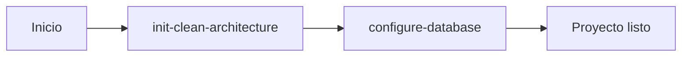

# Guías de Desarrollo - APSYS Backend

## Descripción General

Este directorio contiene las **guías de desarrollo** que utiliza el servidor MCP (Model Context Protocol) de APSYS para automatizar la creación y configuración de proyectos backend con Clean Architecture.

Cada carpeta representa un **tool** del servidor MCP, con documentación detallada de todos los pasos necesarios para su ejecución.

## Estructura del Directorio

```
guides/
├── README.md                          # Este archivo
├── init-clean-architecture/           # Tool #1: Inicialización de proyecto
│   ├── README.md
│   ├── 01-estructura-base.md
│   ├── 02-domain-layer.md
│   ├── 03-infrastructure-filtering.md       (pendiente)
│   ├── 04-infrastructure-repositories.md    (pendiente)
│   ├── 05-application-layer.md              (pendiente)
│   ├── 06-webapi-base.md                    (pendiente)
│   ├── 07-migrations-base.md                (pendiente)
│   └── 08-testing-projects.md               (pendiente)
│
└── configure-database/                # Tool #2: Configuración de BD
    ├── README.md                             (pendiente)
    ├── 01-setup-postgresql.md                (pendiente)
    └── 02-setup-sqlserver.md                 (pendiente)
```

## Tools Disponibles

### 1. init-clean-architecture

**Estado:** 🟡 En desarrollo (Milestone 1 completado)

**Propósito:** Crea la estructura completa de un proyecto backend con Clean Architecture, independiente de cualquier base de datos específica.

**Documentación:** [init-clean-architecture/README.md](./init-clean-architecture/README.md)

**Parámetros:**
```bash
init-clean-architecture --name=MiProyecto --version=net9.0 --path=C:\projects\miproyecto
```

**Componentes generados:**
- ✅ Solución .NET con gestión centralizada de paquetes
- ✅ Capa de dominio completa
- ⏳ Sistema de filtering e infrastructure
- ⏳ Capa de aplicación
- ⏳ API REST con FastEndpoints
- ⏳ Sistema de migraciones
- ⏳ Proyectos de testing

**Progreso de Milestones:**
- ✅ Milestone 1: Estructura base + Domain layer (Completado)
- ⏳ Milestone 2: Infrastructure (Pendiente)
- ⏳ Milestone 3: Application, API y Testing (Pendiente)

---

### 2. configure-database

**Estado:** ⏳ Pendiente

**Propósito:** Configura un proyecto existente para trabajar con una base de datos específica (PostgreSQL o SQL Server).

**Documentación:** [configure-database/README.md](./configure-database/README.md) *(pendiente)*

**Parámetros:**
```bash
configure-database --project-path=C:\projects\miproyecto --db=PostgreSQL
# o
configure-database --project-path=C:\projects\miproyecto --db=SQLServer
```

**Componentes que configura:**
- Paquetes NuGet específicos de BD
- Driver y dialect de NHibernate
- ConnectionStringBuilder
- Proyecto NDbUnit
- Configuración de migraciones
- Archivo .env con variables de entorno

---

## Flujo de Trabajo Recomendado

Para crear un proyecto backend completo desde cero:



### Paso 1: Inicializar arquitectura base

```bash
init-clean-architecture --name=MiProyecto --version=net9.0 --path=C:\projects\miproyecto
```

**Resultado:** Proyecto con Clean Architecture, sin configuración de BD específica.

### Paso 2: Configurar base de datos

```bash
configure-database --project-path=C:\projects\miproyecto --db=PostgreSQL
```

**Resultado:** Proyecto completamente configurado y listo para desarrollo.

---

## Arquitectura de los Proyectos Generados

Todos los proyectos siguen los principios de **Clean Architecture**:

```
┌─────────────────────────────────────────┐
│         Capa de Presentación            │
│            (WebApi)                     │
│   - FastEndpoints                       │
│   - Swagger                             │
└──────────────┬──────────────────────────┘
               │
┌──────────────▼──────────────────────────┐
│       Capa de Aplicación                │
│       (Application)                     │
│   - Casos de uso                        │
│   - DTOs                                │
└──────────────┬──────────────────────────┘
               │
┌──────────────▼──────────────────────────┐
│         Capa de Dominio                 │
│           (Domain)                      │
│   - Entidades                           │
│   - Interfaces                          │
│   - Reglas de negocio                   │
└──────────────▲──────────────────────────┘
               │
┌──────────────┴──────────────────────────┐
│      Capa de Infraestructura            │
│        (Infrastructure)                 │
│   - Repositorios                        │
│   - NHibernate                          │
│   - BD específica                       │
└─────────────────────────────────────────┘
```

### Principios Clave

✅ **Independencia de frameworks:** Lógica de negocio sin dependencias externas
✅ **Independencia de UI:** Domain no conoce la API
✅ **Independencia de BD:** Domain no conoce la persistencia
✅ **Testeable:** Cada capa tiene sus propios tests
✅ **Separación de responsabilidades:** Cada capa tiene un propósito claro

---

## Stack Tecnológico

### Backend Core
- **.NET 9.0** - Framework base
- **C# 13** - Lenguaje

### API & Web
- **FastEndpoints 7.0** - Framework de API REST
- **Swagger/OpenAPI** - Documentación de API
- **JWT Bearer** - Autenticación

### Persistencia
- **NHibernate 5.5** - ORM
- **FluentMigrator 7.1** - Migraciones de BD
- **PostgreSQL** o **SQL Server** - Base de datos

### Validación & Mapeo
- **FluentValidation 12.0** - Validaciones
- **AutoMapper 15.0** - Mapeo de objetos

### Testing
- **NUnit 4.2** - Framework de testing
- **Moq 4.20** - Mocking
- **AutoFixture 4.18** - Generación de datos de prueba
- **FluentAssertions 8.5** - Aserciones fluidas

### Utilidades
- **Spectre.Console 0.50** - CLI interactiva
- **DotNetEnv 3.1** - Variables de entorno
- **System.Linq.Dynamic.Core 1.6** - LINQ dinámico

---

## Formato de Documentos

Cada documento de guía sigue un formato estándar:

### Secciones Obligatorias

1. **Descripción:** Qué hace este componente
2. **Dependencias:** Qué pasos previos se requieren
3. **Parámetros de Entrada:** Qué datos necesita
4. **Estructura de Archivos:** Qué se creará
5. **Paquetes NuGet:** Qué dependencias se instalan
6. **Proceso de Construcción:** Comandos paso a paso
7. **Código Fuente:** Contenido completo de archivos
8. **Validación:** Cómo verificar que funcionó
9. **Siguientes Pasos:** Qué hacer después
10. **Troubleshooting:** Problemas comunes

### Variables de Sustitución

Los documentos usan placeholders que el servidor MCP debe reemplazar:

| Placeholder | Descripción            | Ejemplo          |
| ----------- | ---------------------- | ---------------- |
| `{name}`    | Nombre del proyecto    | `MiProyecto`     |
| `{path}`    | Ruta del proyecto      | `C:\projects\..` |
| `{version}` | Versión de .NET        | `net9.0`         |
| `{db}`      | Tipo de base de datos  | `PostgreSQL`     |

---

## Uso de las Guías

### Para Usuarios del Servidor MCP

El servidor MCP ejecutará automáticamente todos los pasos. Simplemente invoca el tool:

```bash
# Vía MCP
init-clean-architecture --name=MiProyecto --version=net9.0 --path=C:\projects\miproyecto
```

### Para Desarrollo Manual

Las guías también pueden seguirse manualmente para:

- **Aprendizaje:** Entender cómo funciona cada componente
- **Debugging:** Identificar problemas en pasos específicos
- **Extensión:** Agregar componentes personalizados

Simplemente abre el documento relevante y ejecuta los comandos secuencialmente.

---

## Estado del Proyecto

### Completado ✅

- [x] Estructura de carpetas para guías
- [x] Tool: init-clean-architecture
  - [x] Milestone 1: Estructura base + Domain layer
    - [x] 01-estructura-base.md
    - [x] 02-domain-layer.md

### En Progreso 🟡

- [ ] Tool: init-clean-architecture
  - [ ] Milestone 2: Infrastructure
    - [ ] 03-infrastructure-filtering.md
    - [ ] 04-infrastructure-repositories.md
  - [ ] Milestone 3: Application, API y Testing
    - [ ] 05-application-layer.md
    - [ ] 06-webapi-base.md
    - [ ] 07-migrations-base.md
    - [ ] 08-testing-projects.md

### Pendiente ⏳

- [ ] Tool: configure-database
  - [ ] README.md
  - [ ] 01-setup-postgresql.md
  - [ ] 02-setup-sqlserver.md

---

## Contribuir

Para agregar o modificar guías:

1. **Extraer información:** Del [MANUAL_CONSTRUCCION_PROYECTO.md](../MANUAL_CONSTRUCCION_PROYECTO.md)
2. **Seguir formato:** Usar la estructura estándar de documentos
3. **Probar comandos:** Ejecutar manualmente antes de documentar
4. **Actualizar README:** Agregar referencias al nuevo contenido
5. **Documentar dependencias:** Indicar qué pasos previos se requieren

### Reglas de Escritura

- ✅ **Comandos completos:** No usar "..." o placeholders sin explicar
- ✅ **Ejemplos concretos:** Siempre incluir ejemplo con valores reales
- ✅ **Código completo:** Nunca usar "// resto del código aquí"
- ✅ **Paths multiplataforma:** Usar `/` en ejemplos genéricos
- ✅ **Validación explícita:** Cómo verificar que cada paso funcionó

---

## Referencias

- **Manual completo:** [MANUAL_CONSTRUCCION_PROYECTO.md](../MANUAL_CONSTRUCCION_PROYECTO.md)
- **Conversación de diseño:** [conversacion-mcp-servers.txt](../conversacion-mcp-servers.txt)
- **Repositorio principal:** [README.md](../README.md)
- **Documentación MCP:** https://modelcontextprotocol.io/

---

## Preguntas Frecuentes

### ¿Por qué separar init-clean-architecture y configure-database?

Permite máxima flexibilidad:
- Desarrollar lógica de negocio sin decidir la BD
- Cambiar de BD solo re-ejecutando configure-database
- Testing sin dependencias de infraestructura
- Proyectos portables entre equipos

### ¿Puedo usar estas guías sin el servidor MCP?

Sí, absolutamente. Las guías están diseñadas para ser:
- Ejecutables manualmente
- Autocontenidas
- Educativas

### ¿Qué pasa si ya tengo un proyecto existente?

Los tools están diseñados para proyectos nuevos. Para proyectos existentes:
- Usa las guías como referencia para agregar componentes
- Adapta los comandos a tu estructura actual
- Revisa el manual completo para casos especiales

### ¿Cómo reporto problemas o sugiero mejoras?

- Abre un issue en el repositorio
- Describe el problema con contexto (qué guía, qué paso)
- Incluye logs de error si aplica

---

## Licencia

Este proyecto es de uso interno de APSYS.

---

**Última actualización:** 2025-01-29
**Versión:** 1.0.0-milestone1
