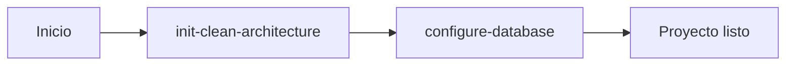

# Guías de Desarrollo - APSYS Backend

## Descripción General

Este directorio contiene las **guías de desarrollo** de APSYS para crear y configurar proyectos backend con Clean Architecture.

Cada carpeta representa una **guía completa** con documentación detallada de todos los pasos necesarios para su ejecución, ya sea manual o automatizada.

## Estructura del Directorio

```
guides/
├── README.md                          # Este archivo
├── init-clean-architecture/           # Guía #1: Inicialización de proyecto
│   ├── README.md                      # Mapa completo de la guía
│   ├── 01-estructura-base.md
│   ├── 02-domain-layer.md
│   ├── 03-application-layer.md
│   ├── 04-infrastructure-layer.md
│   ├── 05-webapi-configuration.md
│   ├── 06-migrations-base.md          (pendiente)
│   └── 07-testing-support.md          (pendiente)
│
└── configure-database/                # Guía #2: Configuración de BD
    ├── README.md                      (pendiente)
    ├── 01-setup-postgresql.md         (pendiente)
    └── 02-setup-sqlserver.md          (pendiente)
```

## Guías Disponibles

### 1. init-clean-architecture

**Estado:** 🟡 En desarrollo (Milestone 4 completado)

**Propósito:** Crea la estructura completa de un proyecto backend con Clean Architecture, independiente de cualquier base de datos específica.

**Documentación:** [init-clean-architecture/README.md](./init-clean-architecture/README.md)

**Componentes generados:**
- ✅ Solución .NET con gestión centralizada de paquetes
- ✅ Capa de dominio completa
- ✅ Capa de aplicación con use cases y DTOs
- ✅ Capa de infraestructura con repositorios y filtering
- ✅ API REST con FastEndpoints
- ⏳ Sistema de migraciones (pendiente)
- ⏳ Proyectos de testing completos (pendiente)

**Progreso de Milestones:**
- ✅ Milestone 1: Estructura base + Domain layer
- ✅ Milestone 2: Application layer
- ✅ Milestone 3: Infrastructure layer
- ✅ Milestone 4: WebApi configuration
- ⏳ Milestone 5: Migrations + Testing support

---

### 2. configure-database

**Estado:** ⏳ Pendiente

**Propósito:** Configura un proyecto existente para trabajar con una base de datos específica (PostgreSQL o SQL Server).

**Documentación:** [configure-database/README.md](./configure-database/README.md) *(pendiente)*

**Componentes que configura:**
- Paquetes NuGet específicos de BD
- Driver y dialect de NHibernate
- ConnectionStringBuilder
- Proyecto NDbUnit
- Configuración de migraciones
- Archivo .env con variables de entorno

---

## Flujo de Trabajo Recomendado

Para crear un proyecto backend completo desde cero:



### Paso 1: Inicializar arquitectura base

Ejecutar las guías de `init-clean-architecture/` en orden secuencial:

1. 01-estructura-base.md
2. 02-domain-layer.md
3. 03-application-layer.md
4. 04-infrastructure-layer.md
5. 05-webapi-configuration.md

Ver [init-clean-architecture/README.md](./init-clean-architecture/README.md) para el mapa detallado.

**Resultado:** Proyecto con Clean Architecture, sin configuración de BD específica.

### Paso 2: Configurar base de datos

Ejecutar las guías de `configure-database/` según la base de datos deseada.

**Resultado:** Proyecto completamente configurado y listo para desarrollo.

---

## Arquitectura de los Proyectos Generados

Todos los proyectos siguen los principios de **Clean Architecture**:

```
┌─────────────────────────────────────────┐
│         Capa de Presentación            │
│            (WebApi)                     │
│   - FastEndpoints                       │
│   - Swagger                             │
└──────────────┬──────────────────────────┘
               │
┌──────────────▼──────────────────────────┐
│       Capa de Aplicación                │
│       (Application)                     │
│   - Casos de uso                        │
│   - DTOs                                │
└──────────────┬──────────────────────────┘
               │
┌──────────────▼──────────────────────────┐
│         Capa de Dominio                 │
│           (Domain)                      │
│   - Entidades                           │
│   - Interfaces                          │
│   - Reglas de negocio                   │
└──────────────▲──────────────────────────┘
               │
┌──────────────┴──────────────────────────┐
│      Capa de Infraestructura            │
│        (Infrastructure)                 │
│   - Repositorios                        │
│   - NHibernate                          │
│   - BD específica                       │
└─────────────────────────────────────────┘
```

### Principios Clave

✅ **Independencia de frameworks:** Lógica de negocio sin dependencias externas
✅ **Independencia de UI:** Domain no conoce la API
✅ **Independencia de BD:** Domain no conoce la persistencia
✅ **Testeable:** Cada capa tiene sus propios tests
✅ **Separación de responsabilidades:** Cada capa tiene un propósito claro

---

## Stack Tecnológico

### Backend Core
- **.NET 9.0** - Framework base
- **C# 13** - Lenguaje

### API & Web
- **FastEndpoints 7.0** - Framework de API REST
- **Swagger/OpenAPI** - Documentación de API
- **JWT Bearer** - Autenticación

### Persistencia
- **NHibernate 5.5** - ORM
- **FluentMigrator 7.1** - Migraciones de BD
- **PostgreSQL** o **SQL Server** - Base de datos

### Validación & Mapeo
- **FluentValidation 12.0** - Validaciones
- **AutoMapper 15.0** - Mapeo de objetos

### Testing
- **NUnit 4.2** - Framework de testing
- **Moq 4.20** - Mocking
- **AutoFixture 4.18** - Generación de datos de prueba
- **FluentAssertions 8.5** - Aserciones fluidas

### Utilidades
- **Spectre.Console 0.50** - CLI interactiva
- **DotNetEnv 3.1** - Variables de entorno
- **System.Linq.Dynamic.Core 1.6** - LINQ dinámico

---

## Formato de Documentos

Cada documento de guía sigue un formato estándar:

### Secciones Obligatorias

1. **Descripción:** Qué hace este componente
2. **Dependencias:** Qué pasos previos se requieren
3. **Validaciones Previas:** Qué verificar antes de empezar
4. **Parámetros de Entrada:** Qué datos necesita (para automatización)
5. **Estructura de Archivos:** Qué se creará
6. **Paquetes NuGet:** Qué dependencias se instalan
7. **Proceso de Construcción:** Comandos paso a paso
8. **Referencia de Templates:** Descripción de templates usados
9. **Verificación:** Cómo verificar que funcionó
10. **Próximos Pasos:** Qué hacer después
11. **Historial de Versiones:** Cambios del documento

### Variables de Sustitución

Los documentos usan placeholders que deben reemplazarse:

| Placeholder | Descripción            | Ejemplo          |
| ----------- | ---------------------- | ---------------- |
| `{ProjectName}` | Nombre del proyecto    | `MiProyecto`     |

**Nota:** Los comandos bash y templates usan `{ProjectName}` que debe reemplazarse con el nombre real del proyecto antes de ejecutar.

---

## Uso de las Guías

### Opción 1: Ejecución Automatizada (con agente IA)

Un agente de IA puede leer estos archivos secuencialmente y ejecutar los comandos automáticamente:

```
1. Leer 01-estructura-base.md
2. Ejecutar comandos bash (reemplazando {ProjectName})
3. Copiar templates (reemplazando {ProjectName})
4. Verificar que el paso funcionó
5. Continuar con el siguiente archivo
```

**Proceso:**
- El agente lee las instrucciones en orden
- Ejecuta los comandos bash
- Copia los templates desde `templates/` reemplazando placeholders
- Verifica que cada paso compile antes de continuar

### Opción 2: Ejecución Manual (paso a paso)

Un desarrollador puede seguir la guía manualmente:

1. Abrir el primer archivo del milestone deseado
2. Leer las instrucciones paso a paso
3. Ejecutar los comandos bash en la terminal
4. Copiar templates manualmente y reemplazar `{ProjectName}`
5. Verificar que cada paso funcione antes de continuar
6. Pasar al siguiente archivo cuando el actual esté completo

**Útil para:**
- **Aprendizaje:** Entender cómo funciona cada componente
- **Debugging:** Identificar problemas en pasos específicos
- **Extensión:** Agregar componentes personalizados

### Opción 3: Ejecución Híbrida

Combinar automatización y manual según necesidades:
- Automatizar pasos repetitivos (creación de proyectos, instalación de paquetes)
- Ejecutar manualmente pasos que requieren decisiones (customización de templates)

---

## Estado del Proyecto

### Completado ✅

- [x] Estructura de carpetas para guías
- [x] Guía: init-clean-architecture
  - [x] Milestone 1: Estructura base + Domain layer
    - [x] 01-estructura-base.md (v1.0.1)
    - [x] 02-domain-layer.md (v1.1.2)
  - [x] Milestone 2: Application layer
    - [x] 03-application-layer.md (v1.2.1)
  - [x] Milestone 3: Infrastructure layer
    - [x] 04-infrastructure-layer.md (v1.3.5)
  - [x] Milestone 4: WebApi configuration
    - [x] 05-webapi-configuration.md (v1.4.5)

### En Progreso 🟡

- [ ] Guía: init-clean-architecture
  - [ ] Milestone 5: Migrations + Testing
    - [ ] 06-migrations-base.md
    - [ ] 07-testing-support.md

### Pendiente ⏳

- [ ] Guía: configure-database
  - [ ] README.md
  - [ ] 01-setup-postgresql.md
  - [ ] 02-setup-sqlserver.md

---

## Contribuir

Para agregar o modificar guías:

1. **Extraer información:** Del [MANUAL_CONSTRUCCION_PROYECTO.md](../MANUAL_CONSTRUCCION_PROYECTO.md)
2. **Seguir formato:** Usar la estructura estándar de documentos
3. **Probar comandos:** Ejecutar manualmente antes de documentar
4. **Actualizar README:** Agregar referencias al nuevo contenido
5. **Documentar dependencias:** Indicar qué pasos previos se requieren
6. **Actualizar versiones:** Incrementar versión del documento y actualizar changelog

### Reglas de Escritura

- ✅ **Comandos completos:** No usar "..." o placeholders sin explicar
- ✅ **Ejemplos concretos:** Siempre incluir ejemplo con valores reales
- ✅ **Código completo:** Nunca usar "// resto del código aquí"
- ✅ **Paths multiplataforma:** Usar `/` en ejemplos genéricos
- ✅ **Validación explícita:** Cómo verificar que cada paso funcionó
- ✅ **Placeholders consistentes:** Usar `{ProjectName}` (no `${ProjectName}` o `<ProjectName>`)

### Formato de Instrucciones de Templates

Usar los formatos estandarizados:

**Para archivos individuales:**
```markdown
📄 COPIAR TEMPLATE: `templates/path/file.cs` → `dest/{ProjectName}/file.cs`

> El agente/usuario debe:
> 1. Descargar el archivo desde `templates/path/file.cs`
> 2. Copiar a `dest/{ProjectName}/file.cs`
> 3. **Reemplazar** el placeholder `{ProjectName}` con el nombre real del proyecto
```

**Para directorios completos:**
```markdown
📁 COPIAR DIRECTORIO COMPLETO: `templates/domain/` → `src/{ProjectName}.domain/`

> El agente/usuario debe:
> 1. Descargar todos los archivos desde `templates/domain/` en GitHub
> 2. Copiarlos a `src/{ProjectName}.domain/` respetando estructura de subdirectorios
> 3. **Reemplazar** el placeholder `{ProjectName}` con el nombre real del proyecto
```

---

## Referencias

- **Manual completo:** [MANUAL_CONSTRUCCION_PROYECTO.md](../MANUAL_CONSTRUCCION_PROYECTO.md)
- **Repositorio principal:** [README.md](../README.md)
- **Templates:** [templates/README.md](../templates/README.md)
- **Versionado:** [VERSIONING.md](../VERSIONING.md)

---

## Preguntas Frecuentes

### ¿Por qué separar init-clean-architecture y configure-database?

Permite máxima flexibilidad:
- Desarrollar lógica de negocio sin decidir la BD
- Cambiar de BD solo re-ejecutando configure-database
- Testing sin dependencias de infraestructura
- Proyectos portables entre equipos

### ¿Puedo usar estas guías manualmente?

Sí, absolutamente. Las guías están diseñadas para ser:
- Ejecutables manualmente paso a paso
- Autocontenidas
- Educativas

### ¿Qué pasa si ya tengo un proyecto existente?

Las guías están diseñadas para proyectos nuevos. Para proyectos existentes:
- Usa las guías como referencia para agregar componentes
- Adapta los comandos a tu estructura actual
- Revisa el manual completo para casos especiales

### ¿Cómo reporto problemas o sugiero mejoras?

- Abre un issue en el repositorio
- Describe el problema con contexto (qué guía, qué paso)
- Incluye logs de error si aplica

---

## Licencia

Este proyecto es de uso interno de APSYS.

---

**Última actualización:** 2025-01-30
**Versión:** 1.4.8-milestone4
